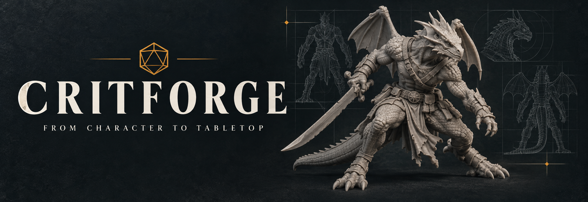
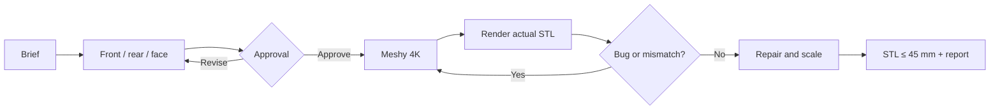

<div align="center">



# CritForge

### From character to reviewed STL.

An agent skill for RPG and board game miniatures with approved references, Meshy 4K geometry, real mesh review, and verified scale.

[](https://github.com/eep0x10/critforge/actions/workflows/validate.yml)
[](requirements-mesh.txt)
[](LICENSE)

[Get started](#get-started) · [Workflow](#workflow) · [Português](README.md)

</div>

> CritForge finishes at a **corrected, scaled, reviewed STL**. Orientation, hollowing, supports, and slicing stay in your slicer.

## Workflow



The default character target is 38 mm, with a hard 45 mm ceiling unless explicitly changed. Characters have no integrated base and fit a separate 32 mm base. Relevant visual or geometry defects block delivery.

## Get started

```powershell
git clone https://github.com/eep0x10/critforge.git "$HOME/.codex/skills/meshy-miniaturas"
Set-Location "$HOME/.codex/skills/meshy-miniaturas"
python -m pip install -r requirements-mesh.txt
python scripts/workflow.py doctor
```

Store `MESHY_API_KEY` in the environment or a secret manager, outside chat and Git. The client never prints it.

Meshy's Multi-Image endpoint currently supports geometry up to 2K. The 4K default uses the approved front view for geometry and keeps rear/face images as mandatory QA references. Use `--mode multi-image-2k` only when multi-view consistency has priority over 4K.

## Documentation

The detailed operational guides are maintained in Portuguese:

- [Quick start](docs/QUICKSTART.md)
- [Skill instructions](SKILL.md)
- [API and recovery](references/commands.md)
- [Mesh review](references/mesh.md)
- [Contributing](CONTRIBUTING.md)

Private projects, models, character images, signed URLs, API responses, and credentials never belong in the public repository.

[MIT license](LICENSE) · [Report an issue](https://github.com/eep0x10/critforge/issues) · [Contribute](CONTRIBUTING.md)

Independent project, not affiliated with Meshy. The code license does not grant rights to third-party characters or models.
