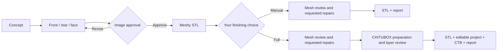

<div align="center">


# CritForge

### From character to tabletop.

An agent skill for RPG and board game miniatures: approved references, Meshy generation, real mesh review, and optional CHITUBOX preparation.

[](https://github.com/eep0x10/critforge/actions/workflows/validate.yml)
[](requirements-mesh.txt)
[](LICENSE)

[Get started](#get-started) · [Workflow](#the-workflow) · [Português](README.md)

</div>

> **You direct the creation. The skill keeps the process organized.** Approve the images before paid generation, then choose a reviewed STL or the complete resin preparation workflow.
>
> *The banner is AI-generated brand illustration, not evidence of a delivered STL or a tested physical print.*

## Built for the whole miniature workflow

| Create | Inspect | Deliver |
| :--- | :--- | :--- |
| Consistent front, rear and face references, reviewed before Meshy. | Actual mesh renders, dimensions, connected components and repair comparisons. | Preserved originals, separate revisions and an evidence report tied to final files. |

**CritForge** is the public name. The installation folder and skill identifier remain **`meshy-miniaturas`** for compatibility. Operational instructions are maintained in Portuguese.

## The workflow



Full preparation follows **orient → assess Hollow → assess Drill → Auto Support Light → Auto Layout → slice → review → save and reopen**. Hollow and Drill may be marked unnecessary with a reason. The workflow never starts a physical print.

## Get started

With Git and Python 3.10+ available:

**PowerShell**

```powershell
git clone https://github.com/eep0x10/critforge.git "$HOME/.codex/skills/meshy-miniaturas"
Set-Location "$HOME/.codex/skills/meshy-miniaturas"
python -m pip install -r requirements-mesh.txt
python scripts/workflow.py doctor
```

<details>
<summary><strong>macOS / Linux</strong></summary>

```bash
git clone https://github.com/eep0x10/critforge.git ~/.codex/skills/meshy-miniaturas
cd ~/.codex/skills/meshy-miniaturas
python3 -m venv .venv
source .venv/bin/activate
python -m pip install -r requirements-mesh.txt
python scripts/workflow.py doctor
```

The Python tools are portable. CHITUBOX interaction depends on your agent's UI tools and operating system.

</details>

Configure `MESHY_API_KEY` privately in the agent's environment. Never paste the key into chat, source files or committed configuration. Image generation and Meshy may consume service credits. The skill does not provide API access or credits.

**Try this prompt**

> Use $meshy-miniaturas / CritForge to create a black dragon warrior with small physical wings in an action pose. No integrated base; it should fit a separate 32 mm base. Generate front, rear and face references, review them, and ask me to approve before Meshy. Once the STL is available, ask whether I want to slice it myself or use the full preparation workflow.

### What you need

| Stage | Requirement |
| :--- | :--- |
| Reference images | An agent with image generation tools |
| Mesh generation | Meshy API access, credits and an environment key |
| Mesh inspection | `requirements-mesh.txt` |
| Actual mesh previews | Local Blender; worker tested with 4.5 |
| Self-intersection checks | Optional `pymeshlab` |
| Full slicing | CHITUBOX and compatible agent UI controls |

## Two delivery modes

| | Manual slicing | Full preparation |
| :--- | :---: | :---: |
| Visual and geometry review | ✓ | ✓ |
| Requested repairs and scale changes | ✓ | ✓ |
| Final STL and evidence report | ✓ | ✓ |
| Orientation, applicable cavities/drains and supports | — | ✓ |
| Editable project and reviewed CTB | — | ✓ |

The manual option skips slicer interaction. No measured token savings are claimed.

## Evidence, not just a finished filename

- **File-bound approvals:** image approvals and final reviews retain artifact hashes.
- **Resumable generation:** uncertain submissions block another POST until the existing task is recovered.
- **Verified downloads:** partial or structurally invalid STL/GLB files are rejected.
- **Real geometry previews:** Blender renders the mesh without remeshing or decimating it.
- **Before/after comparisons:** inspect closure, components, dimensions and reliable volume changes.
- **Required deliverables:** reports remain incomplete if final files or current evidence are missing.

Digital checks do not certify physical print success, wall strength, drainage or calibration. A watertight mesh still needs review. The included LD-006 / Standard V2 grey settings are an initial reference, not a calibrated native CHITUBOX profile. A 32 mm base describes footprint, not character height.

<details>
<summary><strong>Is CHITUBOX fully automated or headless?</strong></summary>

No. The scripts cover project state, API calls, files, inspection and previews. CHITUBOX requires UI control and visual verification. This repository does not include a headless slicer or a CHITUBOX MCP server.

</details>

## Documentation

The detailed guides below are in Portuguese; CLI help is available in English.

| Guide | Contents |
| :--- | :--- |
| [Quick start](docs/QUICKSTART.md) | Installation, dependencies, private configuration and first project |
| [Skill instructions](SKILL.md) | The agent's operational workflow |
| [Image references](references/images.md) | Consistency and approval |
| [Commands and recovery](references/commands.md) | API, retries and delivery contract |
| [Mesh review](references/mesh.md) | Scale, components, real previews and repair comparison |
| [CHITUBOX](references/chitubox.md) | Orientation, hollowing, drainage, supports and layer review |
| [Contributing](CONTRIBUTING.md) | Offline tests and publication privacy |
| [Brand](docs/BRAND.md) | Name, banner and provenance |

## Privacy and licensing

Private projects stay outside the skill checkout. The public package contains code, documentation, reference settings and explicitly approved brand artwork. No customer models, reference images, exported printer profiles, API responses or credentials belong in the repository.

Publication uses a file allowlist and history scanning; binary brand assets require an explicitly reviewed hash. Tests run offline and do not spend Meshy credits or operate a printer.

---

[MIT license](LICENSE) · [Report an issue](https://github.com/eep0x10/critforge/issues) · [Contribute](CONTRIBUTING.md)

Independent project, not affiliated with Meshy, CHITUBOX or Creality. The code license does not grant rights to third-party characters or models.
