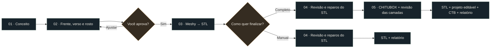

<div align="center">


# CritForge

### Do personagem à mesa de jogo.

Uma skill para transformar ideias em miniaturas de RPG e boardgame — com referências aprovadas, geração 3D no Meshy, revisão da malha e fatiamento opcional no CHITUBOX.

[](https://github.com/eep0x10/critforge/actions/workflows/validate.yml)
[](requirements-mesh.txt)
[](LICENSE)
[](README.en.md)

[Começar](#comece-em-poucos-minutos) · [Como funciona](#da-ideia-ao-arquivo) · [Guias](#explore-a-documentação) · [English](README.en.md)

</div>

> **Você dirige a criação. A skill organiza o processo.** Aprove as referências antes da geração paga e escolha se quer apenas o STL revisado ou a preparação completa para resina.
>
> *O banner é uma ilustração de marca criada com IA. Não representa um STL entregue nem uma impressão física testada.*

## Uma oficina para sua próxima aventura

| Crie com intenção | Revise com evidência | Entregue com organização |
| :--- | :--- | :--- |
| Frente, verso e rosto do mesmo personagem. Pose, anatomia e detalhes revisados antes do Meshy. | Vistas da malha real, medidas, componentes e comparação antes/depois dos reparos. | Originais preservados, revisões separadas e relatório vinculado aos arquivos finais. |

**CritForge** é o nome da skill. O identificador de instalação e invocação continua sendo **`meshy-miniaturas`**; o repositório e os comandos existentes permanecem compatíveis.

## Da ideia ao arquivo



O fluxo completo segue **orientar → avaliar Hollow → avaliar Drill → Auto Support Light → Auto Layout → fatiar → revisar → salvar e reabrir**. Hollow e Drill podem ser dispensados com justificativa; a avaliação sempre faz parte do processo.

## Comece em poucos minutos

### 1. Instale a skill em ambiente isolado

Com Git e Python 3.10+ disponíveis, clone a pasta no diretório de skills do Codex:

**PowerShell**

```powershell
git clone https://github.com/eep0x10/critforge.git "$HOME/.codex/skills/meshy-miniaturas"
Set-Location "$HOME/.codex/skills/meshy-miniaturas"
python -m venv .venv
./.venv/Scripts/python.exe -m pip install -r requirements-mesh.txt
./.venv/Scripts/python.exe scripts/workflow.py doctor
```

<details>
<summary><strong>macOS / Linux</strong></summary>

```bash
git clone https://github.com/eep0x10/critforge.git ~/.codex/skills/meshy-miniaturas
cd ~/.codex/skills/meshy-miniaturas
python3 -m venv .venv
source .venv/bin/activate
python -m pip install -r requirements-mesh.txt
python scripts/workflow.py doctor
```

Os scripts Python são portáveis. O controle do CHITUBOX depende das ferramentas de interface disponíveis no seu agente e sistema.

</details>

Já tem a skill instalada? Faça backup de alterações locais antes de atualizar. Consulte o [guia de início](docs/QUICKSTART.md) para requisitos, atualização e organização do projeto.

### 2. Prepare as ferramentas da etapa

| Você quer… | Vai precisar de… |
| :--- | :--- |
| Gerar as referências | Agente com ferramenta de geração de imagens |
| Gerar o modelo 3D | Conta Meshy com acesso à API e créditos; `MESHY_API_KEY` no ambiente |
| Inspecionar e comparar malhas | Dependências de `requirements-mesh.txt` |
| Renderizar vistas reais | Blender local; worker testado em 4.5 |
| Conferir auto-interseções | `pymeshlab`, opcional |
| Preparar e fatiar | CHITUBOX local e ferramenta de interface compatível |

**Configure a chave fora do chat e do repositório.** `doctor` informa apenas se ela está disponível, sem exibir o valor. Geração de imagens e Meshy podem consumir créditos dos respectivos serviços.

### 3. Descreva sua miniatura

> Use **$meshy-miniaturas / CritForge** para criar um guerreiro dracônico negro, bárbaro com pequenas asas físicas, em pose de combate. Quero uma miniatura sem base, para uma base separada de 32 mm. Gere frente, verso e detalhe do rosto; revise as imagens e peça minha aprovação antes do Meshy. Depois do STL, pergunte se quero fatiar manualmente ou fazer a preparação completa.

A skill orienta o agente; ela não instala automaticamente serviços, não cria créditos e não substitui as ferramentas necessárias.

## Escolha a sua entrega

| | STL para fatiar manualmente | Preparação completa |
| :--- | :---: | :---: |
| Revisão visual e geométrica | ✓ | ✓ |
| Reparos e escala solicitados | ✓ | ✓ |
| STL final sem base, para personagens | ✓ | ✓ |
| Relatório e arquivos organizados | ✓ | ✓ |
| Orientação, Hollow/Drill quando aplicáveis e suportes | — | ✓ |
| Projeto editável + CTB revisado | — | ✓ |
| Acionar a impressora | — | — |

A opção manual economiza as etapas de interação com o fatiador. Não há medição publicada de economia de tokens.

## Qualidade que você consegue conferir

- **Aprovações vinculadas aos arquivos:** os hashes registram quais imagens foram aprovadas e quais modelos foram revisados.
- **Geração com retomada:** uma resposta incerta bloqueia novo envio; recupere a tarefa existente antes de gerar novamente.
- **Downloads verificados:** arquivos parciais ou estruturas STL/GLB inválidas não são promovidos a originais concluídos.
- **Vistas reais:** Blender renderiza o modelo; uma imagem gerada por IA nunca substitui a inspeção do STL.
- **Reparos comparáveis:** mudanças de dimensões, volume confiável, fechamento e componentes recebem alertas para revisão.
- **Entrega verificável:** o relatório exige os arquivos finais e evidências atuais. Ele não certifica resistência, calibração ou sucesso físico da impressão.

<details>
<summary><strong>Ver os comandos de revisão</strong></summary>

Execute na pasta da skill; mantenha os projetos e saídas fora dela.

```bash
python scripts/mesh.py inspect model.stl --out /path/to/project/06-verificacao/mesh.json
python scripts/preview.py model.stl --out-dir /path/to/project/06-verificacao/views
python scripts/mesh.py compare before.stl after.stl --out /path/to/project/06-verificacao/comparison.json
python scripts/preview.py after.stl --reference before.stl --out-dir /path/to/project/06-verificacao/comparison
python scripts/workflow.py report /path/to/project
```

As comparações visuais compartilham câmeras. O recorte automático superior precisa de conferência; use `--face X Y Z WIDTH` para enquadrar o rosto explicitamente. Veja a [referência de malha](references/mesh.md).

</details>

## Explore a documentação

| Guia | O que você encontra |
| :--- | :--- |
| [Início rápido](docs/QUICKSTART.md) | Instalação, requisitos, primeiro projeto e configuração privada |
| [Instruções da skill](SKILL.md) | Fluxo operacional que o agente deve seguir |
| [Referências visuais](references/images.md) | Frente, verso, rosto, consistência e aprovação |
| [API, comandos e recuperação](references/commands.md) | Retomada de tarefas, downloads e contrato de entrega |
| [Inspeção e reparo](references/mesh.md) | Escala, componentes, prévias e comparação de revisões |
| [Preparação no CHITUBOX](references/chitubox.md) | Orientação, cavidades, drenagem, suportes e camadas |
| [Como contribuir](CONTRIBUTING.md) | Testes, privacidade e mudanças revisáveis |
| [Identidade visual](docs/BRAND.md) | Nome, banner, origem e uso da marca |

## Perguntas frequentes

<details>
<summary><strong>A base de 32 mm significa que a miniatura tem 32 mm de altura?</strong></summary>

Não. É a área da base separada. A altura depende do personagem e da escala escolhida. Monstros usam áreas em múltiplos de 32 mm por célula, como 2×2 ou 4×2. O encaixe precisa ser conferido no modelo.

</details>

<details>
<summary><strong>Preciso da LD-006 e da resina Standard V2 cinza?</strong></summary>

Esse é o perfil inicial de referência, não uma limitação do conceito. Para outra combinação, adapte impressora, resina e critérios de revisão. O JSON fornecido contém parâmetros iniciais, não calibrados, e não é um perfil nativo importável do CHITUBOX.

</details>

<details>
<summary><strong>O fatiamento é totalmente automático e sem mouse?</strong></summary>

Os scripts automatizam estado, API, arquivos, inspeção e prévias. O CHITUBOX ainda exige uma ferramenta de interface, observação e verificação. Este pacote não fornece um fatiador headless nem integração MCP própria com o CHITUBOX.

</details>

<details>
<summary><strong>Um STL fechado está pronto para imprimir?</strong></summary>

Não necessariamente. Anatomia, paredes finas, resina presa, sucção, suportes e calibração continuam exigindo avaliação. A validação digital e os testes de software não equivalem a uma impressão física bem-sucedida.

</details>

<details>
<summary><strong>O que vai para o GitHub?</strong></summary>

Código, documentação, parâmetros de referência e o banner público aprovado. Projetos, modelos, imagens de personagens, respostas da API, perfis exportados e credenciais ficam fora do pacote. A publicação passa por manifesto de arquivos e auditoria do histórico; ativos binários de marca são autorizados por hash específico.

</details>

---

**Feito para quem quer criar encontros memoráveis — e entender o que está entregando à impressora.**

[Licença MIT](LICENSE) · [Reportar problema](https://github.com/eep0x10/critforge/issues) · [Contribuir](CONTRIBUTING.md)

Projeto independente, sem afiliação com Meshy, CHITUBOX ou Creality. A licença do código não concede direitos sobre personagens ou modelos de terceiros.

## Mapa técnico da oficina

| Entrada | Responsabilidade | Leitura complementar |
| :--- | :--- | :--- |
| `scripts/workflow.py` | Inicialização, estado, decisões e relatório | [Comandos](references/commands.md) |
| `scripts/meshy.py` | Submissão, consulta, recuperação e download | [Início rápido](docs/QUICKSTART.md) |
| `scripts/mesh.py` | Inspeção, comparação e transformação da malha | [Malhas](references/mesh.md) |
| `scripts/preview.py` | Vistas do modelo real com Blender | [Referências e imagens](references/images.md) |
| `references/chitubox.md` | Procedimento de preparação no fatiador | [CHITUBOX](references/chitubox.md) |
| `scripts/validate.py` | Testes offline e auditoria pública | [Contribuição](CONTRIBUTING.md) |

O estado de um projeto é separado da instalação da skill. Um comando que registra aprovação ou evidência não substitui a decisão do usuário nem a inspeção do artefato. Não envie uma nova tarefa paga para resolver uma resposta incerta: recupere o identificador existente conforme o guia.
