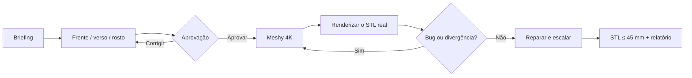

<div align="center">


# CritForge

### Do personagem ao STL revisado.

Uma skill para criar miniaturas de RPG e boardgame com referências aprovadas, geometria 4K no Meshy, revisão visual real e escala validada.

[](https://github.com/eep0x10/critforge/actions/workflows/validate.yml)
[](requirements-mesh.txt)
[](LICENSE)

[Começar](#comece-em-poucos-minutos) · [Fluxo](#o-fluxo) · [English](README.en.md)

</div>

> O CritForge encerra o trabalho no **STL corrigido, dimensionado e revisado**. Orientação, cavidades, suportes e fatiamento ficam no seu fatiador.
>
> *O banner é uma ilustração de marca criada com IA; não representa uma impressão física testada.*

## O fluxo



- **Referências consistentes:** frente, verso e rosto passam por revisão antes da geração paga.
- **Geometria 4K:** usa Meshy 7.1 em 4096³ pela API de imagem única. Verso e rosto permanecem como referências obrigatórias de QA.
- **Falha visível bloqueia entrega:** colisões, peças fundidas, acessórios inventados, mãos ruins e mudanças de identidade exigem reparo ou nova geração.
- **Escala determinística:** humanoides usam 38 mm por padrão e nunca passam de 45 mm sem pedido explícito.
- **Base separada:** personagens cabem em uma base de 32 mm; monstros usam múltiplos da célula de 32 mm.

## Comece em poucos minutos

```powershell
git clone https://github.com/eep0x10/critforge.git "$HOME/.codex/skills/meshy-miniaturas"
Set-Location "$HOME/.codex/skills/meshy-miniaturas"
python -m pip install -r requirements-mesh.txt
python scripts/workflow.py doctor
```

Configure `MESHY_API_KEY` no ambiente ou gerenciador de segredos, fora do chat e do repositório. A skill nunca imprime o valor.

**Exemplo de pedido**

> Use $meshy-miniaturas para criar um guerreiro dracônico em pose de combate, sem base integrada, para base separada de 32 mm. Gere frente, verso e rosto, revise tudo e peça minha aprovação antes do Meshy. Entregue o STL final com no máximo 45 mm.

## Evidências que acompanham o modelo

| Etapa | Verificação |
| :--- | :--- |
| Imagens | Hashes das três vistas aprovadas |
| Geração | Tarefa retomável, modo e resolução registrados |
| Estrutura | Componentes, fechamento, normais e auto-interseções |
| Aparência | Seis renders do STL real, incluindo detalhe do rosto |
| Escala | Dimensões finais e encaixe conservador na base |
| Entrega | Hash do STL final e relatório ligado ao mesmo arquivo |

O endpoint Multi-Image do Meshy aceita geometria até 2K. O padrão 4K usa a vista frontal como geometria e compara o resultado com as outras vistas. Para priorizar consistência multivista, use `--mode multi-image-2k` conscientemente.

## Documentação

| Guia | Conteúdo |
| :--- | :--- |
| [Início rápido](docs/QUICKSTART.md) | Instalação, projeto e retomada |
| [Instruções da skill](SKILL.md) | Processo operacional do agente |
| [Referências visuais](references/images.md) | Consistência e aprovação |
| [API e recuperação](references/commands.md) | 4K, 2K multivista, downloads e falhas |
| [Revisão de malha](references/mesh.md) | Escala, componentes, prévias e reparos |
| [Contribuição](CONTRIBUTING.md) | Testes e privacidade |

## Privacidade

Projetos, modelos, imagens, respostas da API, URLs assinadas e credenciais ficam fora do repositório. A publicação usa uma lista explícita de arquivos e uma auditoria de todo o histórico Git.

[Licença MIT](LICENSE) · [Reportar problema](https://github.com/eep0x10/critforge/issues) · [Contribuir](CONTRIBUTING.md)

Projeto independente, sem afiliação com Meshy. A licença do código não concede direitos sobre personagens ou modelos de terceiros.
